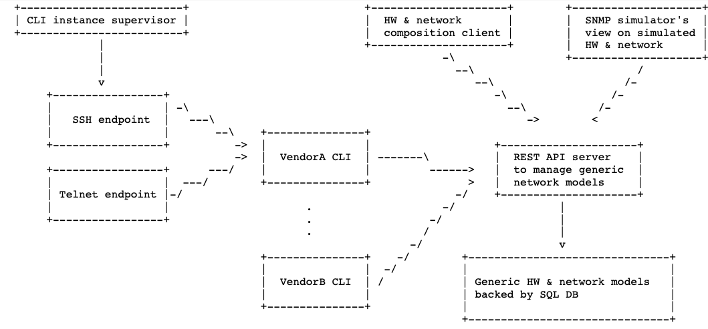

# Network equipment simulator

*This project is being in active development. Not ready for use yet!*

The goal of `softboxen` project is to simulate the presence of a large number
of network devices (such as switches, routers, modems etc) on the network.

These simulated devices expose their management interfaces and support
command-line dialogues in a reasonably convincing way. The main use-case
for `softboxen` is to create a testing environment for network management
and automation harness.

The system architecture being considered at the moment is this:

## What's done

The project is being gradually developed. As of this time, the efforts have
been mostly focused on CLI pieces. This is what is more or less done:

* REST API client library that can also work against locally hosted JSON
  files.
* A CLI simulation framework (including models of simulated hardware) and
  simulation tool
* An example switch simulation extension package (`softboxen-example-switch`)
  that can be pip-installed and hooked up by the CLI simulation tool
* A tree of JSON files implementing an example network device

## What's not done yet:

* REST API server backed by a SQL DB to host simulatied network devices
* Network transport endpoints (telnet, ssh etc.)to access simulated CLIs

## How to evaluate simulated example CLI

The easiest way to play with example CLI (shipped along with main) distribution
as the `softboxen-example-switch`) is to run `example` tox job:

    $ tox -e example
    
     / ____|      / _| | | |
    | (___   ___ | |_| |_| |__   _____  _____ _ __
     \___ \ / _ \|  _| __| '_ \ / _ \ \/ / _ \ '_ \
     ____) | (_) | | | |_| |_) | (_) >  <  __/ | | |
    |_____/ \___/|_|  \__|_.__/ \___/_/\_\___|_| |_|
    
    
    Hint: login credentials: admin/secret
    
    login:admin
    Password:secret
    Last login on 01.03.2020

Interactive menus will guide you through the implemented commands.

## How to simulate a new box

Adding new network device involves creating one or more `CommandProcessor`
classes and Jinja2 templates.

### Command processor

Each command processor implements handling of CLI commands at a single nesting
level. If you need to implement nesting (e.g. enable->configure), more
daisy chained `CommandProcessors` will be needed.

Individual commands take shape `do_` or `do_not_` prefixed methods. Methods are
invoked in response to user-entered commands. When called, each method is
passed the entire backend model as a Python object. The method can inspect
and/or modify the model as desired.

See [softboxen-network-switch](https://github.com/etingof/softboxen/blob/master/examples/softboxen-example-switch/softboxen_example_switch/main.py#L12)
`CommandProcessor` classes for inspiration.

### Command output

Jinja2 templates can be used to model CLI command responses. Some parts of the
response can be pasted as-is, while some pieces can be substituted at runtime,
perhaps from device model properties.

By default, Jinja2 templates are organized in a directory tree reflecting
the nesting of the CLI commands. Individual templates residing in each
directory are used for rendering command output, some pre-defined templates
are invoked automatically:

* `on_enter.j2` - when entering this nesting level
* `on_exit.j2` - when leaving this nesting level
* `on_cycle.j2` - on each REPR cycle
* `on_error.j2` - on command execution failure

See [softboxen-example-switch](https://github.com/etingof/softboxen/tree/master/examples/softboxen-example-switch/softboxen_example_switch/templates/example/switch/1)
templates for more information.

### Simulation data

All simulation data should be ultimately hosted and managed by the REST API
server. While not implemented or for development purposes, simulation data can
be placed into a tree of JSON files.

A single, universal network device model is used for backing all flavors of
simulated devices. When instantiated, each model is tied to a specific CLI
frontend flavor (by means of `vendor`, `model` and `version` attributes) and
represents a single specific network device identified by `uuid` attribute.

When CLI simulation tool is started, it should be given `uuid` to point to a
specific instance of a model. Once a model is found, CLI tool will try
to discover and load required CLI implementation by searching installed
extension modules by `vendor`, `model` and `version` model attributes.

Instantiating models and tying them up with specific CLI simulation models
is thought to be done via admin interface of REST API.

See [softboxen-example-switch](https://github.com/etingof/softboxen/tree/master/examples/models)
models for more information.

## How to get softboxen

The softboxen package is distributed under terms and conditions of 2-clause
BSD [license](https://github.com/etingof/softboxen/LICENSE.rst). Source code is freely
available as a GitHub [repo](https://github.com/etingof/softboxen).

You could `pip install softboxen` or download it from [PyPI](https://pypi.org/project/softboxen).

If something does not work as expected, 
[open an issue](https://github.com/etingof/softboxen/issues) at GitHub.

Copyright (c) 2020, [Ilya Etingof](mailto:etingof@gmail.com). All rights reserved.
