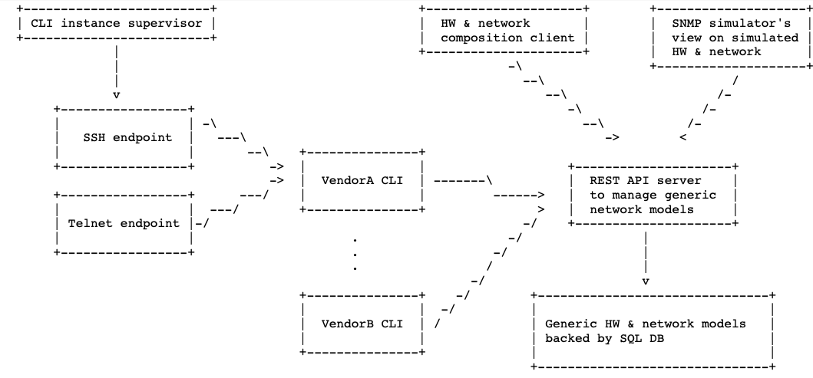

Architecture
------------

The overall system architecture is depicted on the following
high-level diagram:

Essentially, `softboxen` is a conventional web-app that includes
REST API server and REST API client tools. REST API server maintains
the models of the emulated devices, while REST API client is provides
command-line interface of the emulated device to the ultimate consumer.

Let's examine the roles of the components in greater details.

REST API server & models
++++++++++++++++++++++++

The `softboxen-restapi` tool is a WSGI application implementing
Management API server. Also known as `softboxen.wsgi:app` when run under
a WSGI server.

The role of REST API server is to maintain and expose a collection of models
representing the properties of the emulated network devices as seen by the
human operator at the command-line interface. In the Web parlance, REST API
server can be considered being a backend of the `softboxen` system.

Each model of the emulated device is pre-composed of the appropriate number of
emulated hardware components (such as ethernet ports, ADSL modems etc.) and is
assigned four identifiers that are used by the REST API client. The first
three of them together specify the kind of emulated device:

* Vendor ID: specifies that this `softboxen` model emulates a network device
  manufactured by this vendor (e.g. cisco)
* Model ID: specifies that this `softboxen` model emulates a network device
  of this specific model (e.g. 5300)
* Version ID: specifies that this `softboxen` model emulates a network device
  of certain hardware and/or software version (e.g. ios-12.2)

The last identifier distinguishes an instance of some particular device kind:

* UUID: an identifier that is unique to one specific instance of the emulated
  device. For example, if you have two exactly the same network switches on
  the network, they will have the same vendor/model/version IDs, but distinct
  UUID.

The models of emulated devices are reasonably generic. They hold the excess of
properties to cover all possible features provided by different vendors and
models of network devices. The differentiation between various devices and
their implementations is done entirely in the REST API client.

REST API client / CLI frontend
++++++++++++++++++++++++++++++

The `softboxen-cli` REST API client tool serves two purposes:

* Access and modify the properties of the models held at the REST API
  server backend.
* Emulate network device admin user CLI interface operating on the model
  data.

The CLI emulation functionality is implemented by rendering Jinja2 templates
in the context of device model object. Each "screen" i.e. CLI response that
the operator observes is normally maintained in a dedicated template file.

CLI commands and input processing is implemented in Python code. Both
templates and CLI commands implementation are highly specific to the kind
of emulated device. For that reason, templates & CLI code is normally kept
in a dedicated Python package that is automatically discoverable by
`softboxen` client tool.

The CLI implementation package is matched with the backend models by vendor ID,
model ID and version ID properties of the backend model.

To illustrate that, the `softboxen-cli` tool can list all installed CLI
implementation packages it discovers on the system:

.. code-block:: bash

    $ softboxen-cli  --list-clis
    Vendor cisco, model 5300, version 12.1
    Vendor Zyxel, model DSL-630, version 1.1
    Vendor Juniper, model EX-4500, version 5.1

In addition to the first three (vendor, model and version), the forth
identifier - UUID is required to address any concrete network device.

REST API client expects UUID of the model to pull first three identifiers
from it and select respective CLI implementation package. The client then
will go on using model's data for CLI screens rendering and storing
operator-requested changes to the emulated switch.

.. code-block:: bash

    $ softboxen-cli --service-root examples/models/softboxen/v1/index.js \
        --box-uuid 123e4567-e89b-12d3-a456-426655440000

Refer to :doc:`development` chapter for in-depth information on CLI
implementation packages.

CLI servers
+++++++++++

Network devices typically offer CLI access via serial line, telnet and ssh. To
fully emulate network device, REST API client tool can be configured as a login
shell on a Linux box perhaps bound to a dedicated network address.

It is in project's TODO list, however, to add a specialized telnet/ssh server
runner that might be easier to re/configure and manage at scale.

The CLI instance supervisor, once implemented, will manage telnet/ssh servers
probably via its own REST API.

